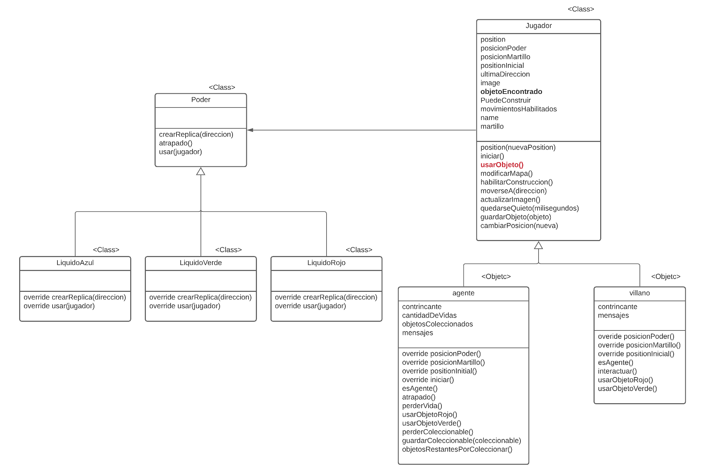

# Informe de Aplicación de los Conceptos de PdeP

## Polimorfismo

**Mensaje polimórfico: usar(jugador)**

**Objetos que lo implementan:** objetoAzul, objetoRojo, objetoVerde

**Objeto que lo aprovecha:** agente y villano: en el metodo usarObjeto(), independientemente de que jugador sea (es un metodo heredado de la clase Jugador), este hace objetoEncontrado.usar(self) y no le importa lo hace cada objeto de poder encontrado, sólo los trata polimórficamente. ver grafico 1

**Ventaja:** Se pueden agregar Objetos de poder al tablero para que sean colisionados con los jugadores sin modificar absolutamente nada del código, sólo basta con agregar el objeto o clase que implemente el método usar(personaje) <br>

#### **Grafico 1**
		


## Colecciones

### ¿Qué operaciones de colecciones se utilizan? ¿Usaron mensajes con y sin efecto? ¿Para qué?
operación de Colección	con efecto	sin efecto	¿Para qué?
* **isEmpty()**	_sin efecto_ Es usada para consultar si una posición en el tablero esta disponible, para esto hacemos una lista de todos los objetos que se encuentran en la posición y después validamos si esta vacía. <br>
```game.getObjectsIn(position).isEmpty()```

* **last()** _sin efecto_ Es usada para obtener el último objeto coleccionable obtenido por el agente. <br>
```objetosColeccionados.last()```

* **remove(objetoPerdido)** _con efecto_ Es usada para eliminar el objeto coleccionable pasado por parametro de la lista del agente, cuando es atacado por un poder del villano. <br>
```objetosColeccionados.remove(objetoPerdido)```

* **add(coleccionable)** _con efecto_ Es usada para agregar a la lista de objetos coleccionbles del agente un nuevo artículo. <br>
```objetosColeccionados.add(coleccionable)```

* **size()** _sin efecto_ Es usada para objetener la cantidad de objetos recolectados por el agente. <br>
```objetosColeccionados.size()```

* **forEach()** _con efecto_ es usado para mostrar cada uno de los elementos de la lista de vidas. <br>
```lista.forEach({vida => game.addVisual(vida)})```

	tambien se aplico para que aparecieran los muros del laberinto, entre otros elementos de diseño de la pantalla. <br>
	```elementos.forEach({objeto => objeto.aparecer```

	y por ejemplo, para accionar cada posicion del reloj para actualizar la imagen a mostrar de acuerdo a los segundos de my_clock. <br>
	```init_clock.forEach({objeto => objeto.accionar()})```

* **get(indice)** _sin efecto_	es usado para obtener un string de la lista de clock de acuerdo a la posicion pasada por parametro, para posteriomente actualizar el path de la imagen de una posicion del reloj. <br>
```clock.get(indice)```

* **contains** _sin efecto_ es usado para consultar si la posicion pasado por parametro no pertenece a la coleccion de posiciones ocupadas del objeto paredes y asi validar si es una celda disponible del tablero. <br>
```!posicionesOcupadas.contains(posicion)```

	También es usada con el mismo próposito con el objeto laberinto. <br>
	```not position_laberinto.contains(position)```
			

## Clases 

### ¿Usan clases? ¿Por qué?
Hicimos el uso de clases, porque se notó un comportamiento entre distinto objetos que era similar, por lo que se buscó abstraer lo mejor posible este comportamiento compartido y crear un "molde", para evitar la repetición de código. También nos percatamos de que queriamos agregar funcionalidades como los "pinches" o "crear paredes", que consistía solo en replicar muchos objetos con el mismo comportamiento y la misma estructura resultando conveniente el uso de las clases.  Finalmente resultó en las sgtes clases:

1. **objeto:** es la clase más general que ejecuta que un objeto aparezca y desaparezca del tablero 
1. **ObjetoAleatorio:** redefine el metodo de aparecer de la clase Objeto
1. **ObjetoColeccionable:** desarrolla los mensajes que debe entender un objeto coleccionable para que ejecute un comportamiento específico
1. **Poder:** esta clase se enfoca a los mensajes que debe entender un objeto de poder 
1. **LiquidoAzul:** describe el comportamiento que debe ejecutar el poder azul independientemente del juegador que lo acceda
1. **LiquidoVerde:** describe el comportamiento que debe ejecutar el poder verde independientemente del juegador que lo acceda
1. **LiquidoRojo:** describe el comportamiento que debe ejecutar el poder rojo independientemente del juegador que lo acceda
1. **Pinches:** define el comportamiento de las trampas colocadas por el villano.
1. **Reloj:** define el comportamiento de una de las posiciones del reloj

### ¿Dónde o cuándo se instancian los objetos?
1. **objeto:** es instanciada, por ejemplo, en pantalla.wlk, donde se tiene las referencias icono_agente e icono_villano que apunta a objetos que son instancias de esta clase. De igual forma, se encuentran otros objetos de diseño de la pantalla. <br>
```const icono_agente = new Objeto(image = "Objetos/icono_agente.png", position = game.at(11,15))```

1. **ObjetoAleatorio:** no se instancia está clase, ya que es una clase abstracta, que sólo existe para poder compartir código entre sus subclases, no para crear objetos a partir de ella.

1. **ObjetoColeccionable:** es instanciada, por ejemplo, en objetos.wlk, para cada uno de objetos que el agenete debe recoger (4 en total). <br>
```const objetoColeccionable1 = new ObjetoColeccionable(image="Objetos/potion.png", position= game.at(10,8), posicionDestino= game.at(17,15))```

1. **Poder:** no se instancia está clase, ya que es una clase abstracta, que sólo existe para poder compartir código entre sus subclases, no para crear objetos a partir de ella.

1. **LiquidoAzul:** es instanciada en objetos.wlk, para referenciar al objeto de poder azul <br>
```const objetoAzul = new LiquidoAzul(image="Objetos/objeto_azul.png", position = game.at(16,5))```	

1. **LiquidoVerde:** es instanciada en objetos.wlk, para referenciar al objeto de poder verde <br>
```const objetoVerde = new LiquidoVerde(image="Objetos/objeto_verde.png", position = game.at(4,10))```

1. **LiquidoRojo:** es instanciada en objetos.wlk, para referenciar al objeto de poder azul <br>
```const objetoRojo = new LiquidoRojo(image="Objetos/objeto_rojo.png", position = game.at(10,9))```

1. **Pinches:** es instanciada  en villano.wlk, para referenciar una "bomba" y poderla mostrar en pantalla <br>
const bomba = new Pinches(image = "Objetos/pinches.png", position = direccion)

1. **Reloj:** es instanciada, por ejemplo, en pantalla.wlk, para referenciar los sgundos del tiempo de la partida, por lo que hay una posicion 1 representa las centenas de los segundos, la posicion las decenas y la posicion 3 las unidades <br>
```const posc1 = new Reloj( indice = seg.div(100), clock_posc = new Objeto(image = "Objetos/cero.png", position = game.at(6,15)))```

## Herencia
### ¿Entre quiénes y por qué? 
- **Padre** Objeto <br>
	**Hijos** ObjetoAleatorio, Pinches, Martillo, Reloj <br>	 
	**¿por qué?** Objeto  define el comportamiento básico de todos los objetos del juego, y alcanza con definir los mensajes en esta superclase para que todos los hijos, independientemente de su tipo, entiendan los mismos mensajes y encuentren dicha definición mediante _method lookup_. <br>
	**¿Qué comportamiento es común y cuál distinto?** <br>
	_Común:_ tanto los atributos, como los métodos de la clase Objeto <br>
	_distinto:_  todos los atributos y mensajes que aparecen en la sección de métodos de cada subclase hija (ObjetoAleatorio, Pinches, Martillo, Reloj). Ver gráfico 2 <br>

- **Padre** ObjetoAleatorio <br>
	**Hijos**  Poder, ObjetoColeccionable	 <br>
	**¿por qué?** la clase ObjetoAlatorio es abstracta y define el comportamiento para que la posición de un objeto se genere de forma aleatoria en el mapa. Esto sire de molde para las subclases hijas <br>
	**¿Qué comportamiento es común y cuál distinto?** <br>
	_Común:_ tanto los atributos, como los métodos de la clase Objeto y ObjetoAleatorio (se da uso del _method lookup_) <br>
	_distinto:_  todos los atributos y mensajes que aparecen en la sección de métodos de cada subclase hija (Poder, ObjetoColeccionable). Ver gráfico 2 <br>

- **Padre** Poder <br>
	**Hijos** LiquidoAzul, LiquidoVerde, LiquidoRojo <br>	
	**¿por qué?** _FALTA_ <br>
	**¿Qué comportamiento es común y cuál distinto?** <br>
	_Común:_ tanto los atributos, como los métodos de la clase Objeto, ObjetoAleatorio Y Poder (se da uso del _method lookup_) <br>
	_distinto:_  todos los mensajes que aparecen en la seccion de metodos de cada subclase hija (LiquidoAzul, LiquidoVerde, LiquidoRojo). Ver gráfico 2 <br>
	
- **Padre** Jugador <br>
	**Hijos** agente, villano <br>	
	**¿por qué?** _FALTA_ <br>
	**¿Qué comportamiento es común y cuál distinto?**<br>
	_Común:_ tanto los atributos, como los métodos de la clase Jugador (se da uso del _method lookup_) <br>
	_distinto:_  todos los mensajes que aparecen en la seccion de metodos de cada subclase hija (LiquidoAzul, LiquidoVerde, LiquidoRojo). Ver gráfico 1 <br>
	
- **Padre** Direccion <br>
	**Hijos** up, down, left, rigth	<br>
	**¿por qué?** _FALTA_ <br>
	**¿Qué comportamiento es común y cuál distinto?** <br>
	_Común:_ tanto los atributos, como los métodos de la clase Direccion (se da uso del _method lookup_) <br>
	_distinto:_  todos los mensajes que aparecen en la seccion de metodos de cada objeto hijo (up, down, left, rigth). <br>

#### **Grafico 2**


## Composición
### ¿Qué objetos interactúan? ¿Dónde se delega? ¿Por qué no herencia?

Para nuesTro poryecto no se hizo uso de _composición_, ya que con las clases definidas y el uso de herencia se logró manejar el poliformismo de los mensajes que recibían los objetos de poder, de forma oportuna, por lo que no fue necesario la creación de una interfaz para la manipulación de estos mensajes.

