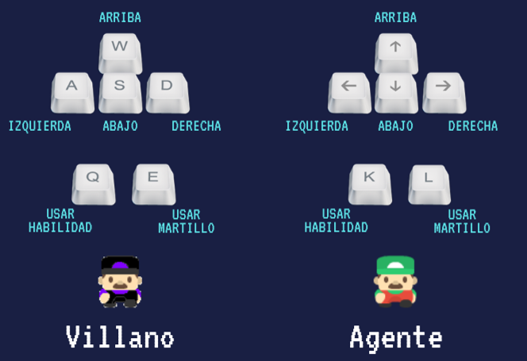

# Juego

**Grupo: Sinergia-Reloadad**

**Integrantes:**
* Maximiliano Afonso (https://github.com/mecsafonso)
* Elena Harutyuyan (https://github.com/elenharu)
* Eliana Rangel (https://github.com/erangelortega)
* Sol Varisco (https://github.com/SolVarisco)

## Descripción
_El Agente de P.d.P._ es un juego local de estrategia en tiempo real con modalidad 1v1 en el cual podrás desafiar a tus amigos, fue creado como resultado del TP Integrador para la materia Paradigmas de Programación de la UTN Facultad Regional Buenos Aires. 

Cada jugador debe elegir uno de los dos personajes para utilizar en la partida y conseguir la victoria:

* **El valiente agente**, que debe conseguir los 4 objetos malditos escondidos por el mapa antes de que se acabe el tiempo para ganar (2 minutos disponibles) ,o 
* **El temerario villano**, quien gana cuando el agente muere 
  
  
Ambos jugadores cuentan con una mecánica completamente original, crear y destruir paredes _(Fornite ©)_ para conseguir la victoria, además, esparcidos por el mapa encontrarán diferentes poderes, que dependiendo el personaje que hayan elegido tendrá un comportamiento diferente _(porque... el polimorfismo es un estilo de vida)_, estos poderes son:

* **Poder Rojo:**
  * **Usado por el agente:** Recupera un vida _(curitas)_
  * Usado por el villano: Deja una bomba en el mapa, si el agente pisa esta bomba, pierde una vida (nota: la bomba es marca ACME)

* **Poder Azul:**
  * **Usado por cualquier personaje:** Funciona como un _teaser_, inmoviliza al jugador contrincante por un corto período de tiempo
  
* **Poder Verde:**
  * **Usado por el agente:** Funciona como un teletransporte
  * **Usado por el villano:** Hace que el agente pierda uno de los objetos que recolectó
  
 **Controles:**
 _El agente_ construye/destruye con la tecla J y utiliza poderes con la K. 
 _El villano_ construye/destruye con la tecla Q y utiliza poderes con la E.
 
 
 
 
 Esperamos que disfruten el juego, y esperamos feedback!!!
